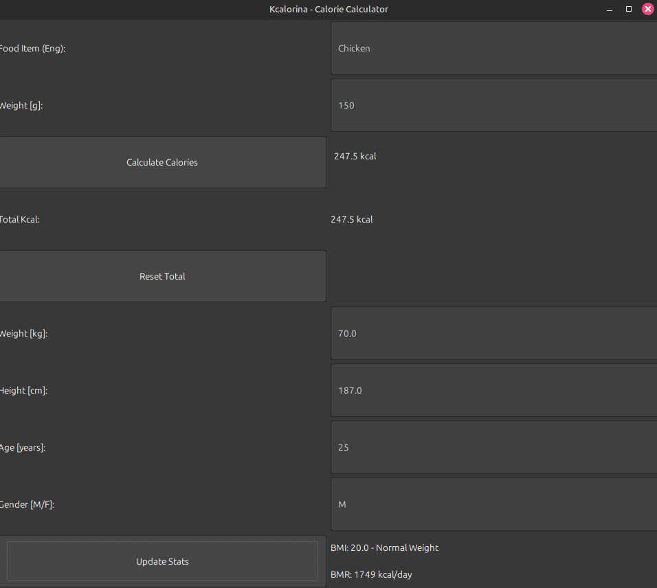

# Kcalorina

A smart calorie tracker built with **Java Swing**. It calculates your daily caloric needs (BMR/BMI) and tracks intake using the Nutritionix API with a robust offline fallback system.



## Key Features
* **Smart Tracking:** Fetches food data via REST API (Nutritionix).
* **Offline Mode:** Fallback to local database if API is unreachable.
* **Health Stats:** Auto-calculates **BMI** and **BMR** (Mifflin-St Jeor equation).
* **Data Parsing:** Handles JSON responses using `org.json`.

## Tech Stack
* Java 17+ (Swing GUI)
* `java.net.http` & `org.json`
* MVC-like Architecture

## How to Run
1.  Clone the repo:
    ```bash
    git clone [https://github.com/Jahgodka/kcalorina.git]
    cd kcalorina
    ```
2.  Add API Keys in `src/NutritionixApiClient.java` (Optional for offline mode).
3.  Compile and Run:
    ```bash
    # Linux / macOS
    mkdir -p out
    javac -cp .:lib/json-20230227.jar -d out src/*.java
    java -cp out:lib/json-20230227.jar Kcalorina
    ```